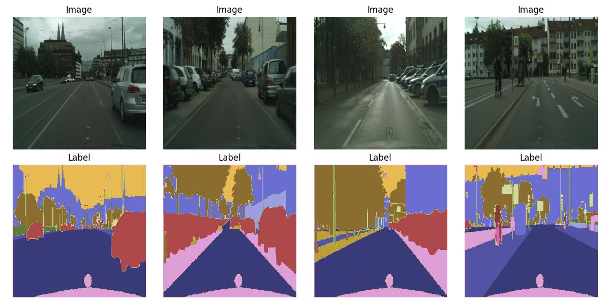

# Deep Learning Models for Image Semantic Segmentation

This project implements and compares deep learning models for semantic segmentation using the **Oxford-IIIT Pet Dataset** and the **Cityscapes Dataset**. The study explores data processing, training strategies, and the performance of two models:
- **FCN ResNet-50** (Fully Convolutional Networks with a ResNet-50 backbone)
- **SegFormer** (Transformer-based model for semantic segmentation)

Key techniques include:
- Preprocessing datasets into normalized PyTorch tensors
- Using **Cross-Entropy Loss** for optimization
- Evaluating performance with **Mean Intersection over Union (mIoU)**

For a detailed explanation of the methodologies, preprocessing steps, model architecture, and training process, please refer to the [report](docs/report.pdf) included in this repository.

## Table of Contents
1. [Datasets](#datasets)
2. [Data Preprocessing](#data-preprocessing)
3. [Models](#models)
   - [FCN ResNet-50](#fcn-resnet-50)
   - [SegFormer](#segformer)
4. [Training and Validation](#training-and-validation)
6. [Results](#results)
7. [Conclusion](#conclusion)

## Datasets
### Oxford-IIIT Pet Dataset
- **Purpose**: Pet image segmentation (dogs and cats)
- **Classes**: Background, Boundary, Foreground
- **Example**:

  

### Cityscapes Dataset
- **Purpose**: Semantic understanding of urban street scenes
- **Classes Used**: 19 out of 30 available
- **Example**:

  

## Data Preprocessing
Data preprocessing ensures that the datasets are suitable for model training and evaluation:
1. **Image Resizing**:
   - All images are resized to **64x64 pixels** for computational efficiency while preserving features for semantic segmentation.
   - Color channels are retained (RGB format).
   
2. **Normalization**:
   - Pixel values are normalized to a range of 0 to 1 by dividing by 255.
   - Ensures stability in optimization during training.

3. **Tensor Transformation**:
   - Images are converted to PyTorch tensors for model compatibility.
   - Labels are also converted to tensor format, ensuring one-to-one mapping with input images.

4. **Special Handling for Cityscapes**:
   - Pixels with the label **255** are excluded from optimization and metric calculations.

## Models
### FCN ResNet-50
- Fully Convolutional Networks are adapted for pixel-wise classification tasks.
- Backbone: **ResNet-50**
- Training Strategies:
  - Training from scratch
  - Fine-tuning pre-trained encoder weights

### SegFormer
- Leverages transformers for effective semantic segmentation.
- Features:
  - Patch-based processing
  - Spatial positional encoding
- Training Strategies:
  - Training from scratch
  - Fine-tuning with pre-trained encoder weights

## Training and Validation
- **Epochs**: 30
- **Batch Size**: 64
- **Optimizer**: AdamW
- **Learning Rate Scheduler**: Exponential decay (gamma = 0.98)

### Performance Metrics
- **Mean Intersection over Union (mIoU)**: Measures segmentation accuracy.
- Custom `SegMetric` class tracks metrics during training.

For other training details, please refer to the [report](docs/report.pdf) included in this repository.

## Results
### FCN ResNet-50 Results
- **Best Performance**: Achieved with fine-tuning.
- **Strengths**: Faster convergence and stable validation metrics.
- **Weaknesses**: Difficulty in segmenting edges and distinguishing classes.

#### FCN ResNet-50 Test Results

#### FCN ResNet-50 Predicted Mask Examples

### SegFormer Results
- **Best Performance**: Achieved with fine-tuning.
- **Strengths**: Effective long-range dependency modeling.
- **Weaknesses**: Slight instability in validation metrics.

#### SegFormer Test Results

#### SegFormer Predicted Mask Examples

## Conclusion
- **Fine-Tuning**: Optimal strategy for both models, balancing training speed and performance.
- **Model Suitability**:
  - **FCN ResNet-50**: Ideal for quick training and robust generalization.
  - **SegFormer**: Excels in high-performance training but may require additional regularization.
